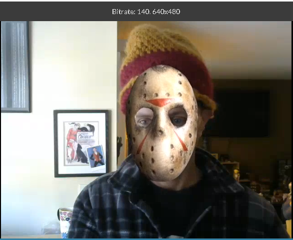

# Face Mask Demo Output

This document shows the expected output when the Face Mask plugin is running on a live video stream.

## Example Output

The plugin uses OpenCV's Haar cascade classifier for real-time face detection on live video streams. Processing happens server-side using the Red5 Pro Brew API, enabling video manipulation before delivery to subscribers.

## How It Works

1. Publisher sends a live video stream to the Red5 Pro server
2. The Facemask plugin intercepts video frames via the Brew API
3. OpenCV processes each frame:
   - Converts YUV to BGR color space
   - Runs face detection using `haarcascade_frontalface_alt.xml`
   - Draws rectangles around detected faces
   - Converts back to YUV
4. Modified frames are encoded and delivered to subscribers
