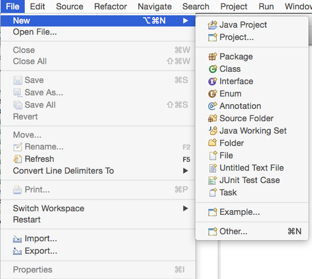
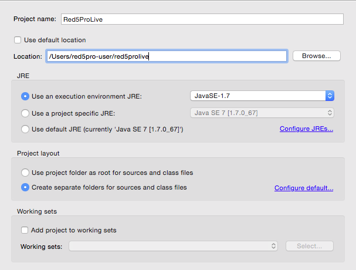
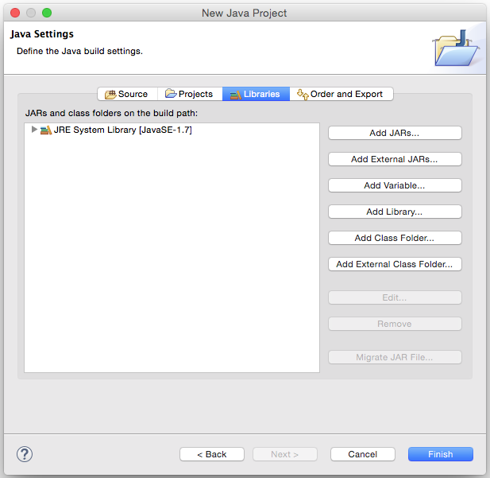
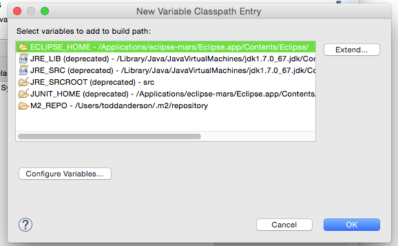
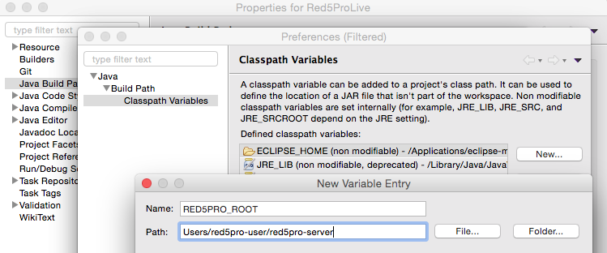
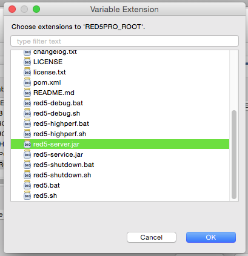
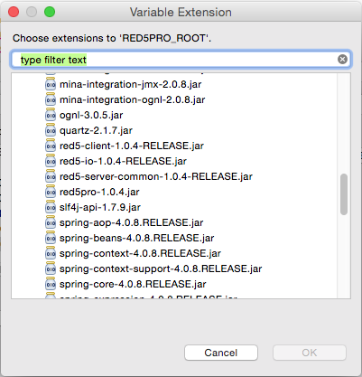

Creating Your First Red5 Pro Server Application
===
In this tutorial, we will walk through the steps to creating your first Red5 Pro Server Application: a service that captures all the available streams currently live on a Red5 Pro server!

If you have not done so already, start an account at [https://account.red5pro.com](https://account.red5pro.com). The Developer account allows for up to 10 concurrent connections, while the Enterprise license has no connection limit.

Requirements
---
The following software is required before starting this tutorial:

### Red5 Pro Server
The Red5 Pro server requires Java 1.7+ or higher. [Install Java 1.7+ or higher](https://java.com/en/download/) if not already install on your machine.

1. Download the Red5 Pro server from [the downloads section](https://account.red5pro.com/download) of the Red5 Pro Accounts site.
2. Unzip into a location on your local system. For the purposes of this tutorial, we will unzip the Red5 Pro server to: _/Users/red5pro-user/red5pro_.
3. __Optional__: [Add your Red5 Pro license](http://link-to-tutorial), if you have signed up for the Enterprise account.
4. Start the Red5 Pro server:
  * On OSX & Linux: Open Terminal, `cd` into your Red5 Pro install directory and issue this command: `./red5.sh`
  * On Windows: Navigate to the Red5 Pro install directory in a File Browser and double-click on `red5.bat`
5. After the server has started, open a web browser and navigate to [http://localhost:5080](http://localhost:5080)
6. If the server has started successfully, you should see the default landing page for the Red5 Pro server install
  * The landing page can be found at _/webapps/root/index.jsp_ of your Red5 Pro installation. You can modify or remove it as desired. For now, we will use it to navigate around and demonstrate what the Red5 Pro server can do!

### Eclipse IDE
For the examples, we will be demonstrating how to set up the project in the [Eclipse IDE](https://eclipse.org/downloads/). The steps for setup should be transferrable to the IDE of your choice, as it is the code and method of deployment that we will be more focused on.

Environment Setup
===
The following steps describe how to setup a new project in the [Eclipse IDE](https://eclipse.org/downloads/) that will be runnable under the Red5 Pro Server.

1. Open the [Eclipse IDE](https://eclipse.org/downloads/) into a new workspace
  * For the purposes of this example, the new workspace directory will be __/Users/red5pro-user/red5prolive__
2. From the main menu, select the _File > New > Java Project_
  
3. In the _Create a Java Project_ dialog, enter in __Red5ProLive__ for the _Project name_ field
  
4. Click __Next__
5. In the _Java Settings_ dialog, select the _Libraries_ tab
  
6. Click the __Add Variable__ button
  * We will be defining our Red5 Pro server install as a library dependency resource
7. In the _New Variable Classpath Entry_ dialog, click __Configure Variables__
  
8. In the _Classpath Variables_ dialog, click __New...__
9. In the _New Variable Entry_ dialog, enter __RED5PRO_ROOT__ for the _Name_ field, and define the _Path_ value as the root of your Red5 Pro server install. For the purposes of this tutorial, that is __/Users/red5pro-user/red5pro-server/__
  
10. Click __OK__ and __OK__ again until you are navigated back to the _New Variable Classpath Entry_ dialog
11. From the _New Variable Classpath Entry_ dialog, select the new __RED5PRO_ROOT__ entry and click __Extend...__
12. Select the __red5-server.jar__ from the listing and click __OK__
  
13. You will be redirected back to the _Java Build Path_ dialog
14. Repeat Steps 6-11, and select the __/lib/red5-server-common.jar__ from the list and click __OK__
  

With our project environment all setup, we can begin developing our first Red5 Pro Server application!

Red5ProLive Application
===
When the Red5 Pro Server is run, applications are accessible using a web browser from the default port of __5080__. If you have the Red5 Pro Server currently running on your machine, you can visit [http://localhost:5080](http://localhost:5080) to see the default landing page.

The default landing page and any other web accessbile applications are stored in the _/webapp_ directory of the Red5 Pro server. In this section, we will be creating a new application to be deployed to this directory. We will utilize the _/webapp/template_ shipped with the Red5 Pro Server distribution and create our first Red5 Pro server application.

__TODO: Need to package red5pro-server-template with Red5 Pro server distribution__

WebApp
---
We will use the webapp template shipped with the Red5 Pro Server as a basis for our custom webapp.

1. From the main menu of the Eclipse IDE, select _Window > Show View > Navigator_ and focus on the _Navigator_ view pane in the IDE
2. Using a File Browser, locate the _/webapps/template_ directory from your Red5 Pro server installation
  * For the purposes of this tutorial, that can be found at __/Users/red5pro-user/red5pro-server/webapps/template__
3. Drag and drop the _template_ directory onto the root __Red5ProLive__ project in the _Navigator_ pane
4. Right-click on the _template_ entry under __Red5ProLive__ project in the _Navigator_ pane and select __Rename...__
5. Rename the imported webapp directory to: __red5prolive__

ApplicationAdapter
---
The server-side application we will create will display the current live streams available on the Red5 Pro Server.

1. From the Navigator pane in the Eclipse IDE, right-click on the __src__ directory and select __New > Class__
2. In the _Java Class_ dialog, enter in the following field values:
  * Package: __com.red5pro.live__
  * Name: __Red5ProLive__
  * Superclass: __org.red5.server.adapter.MultiThreadedApplicationAdapter__
3. Click __Finish__
4. Your workspace should look similar to the following:

Before going any further with our application implementation, we will finish setting up our project to be deployed as a webapp.

WEB-INF
---
We will edit the web template files in order to load the __Red5ProLive__ class created in the previous section.

1. Open the _red5prolive/WEB-INF/red5-web.xml_ file in the Eclipse IDE
2. Select the __Source__ tab from the editor in order to edit the XML markup
3. Replace the `class` value of the `web.handler` bean with that of out newly cerated class: __com.red5pro.live.Red5ProLive__
4. Save the _red5-web.xml_ file
5. Open the _red5-web.properties_ file and change the `webapp.contextPath` value to be __/red5prolive__
6. Save the _red5-web.properties_ file
7. From the Navigator pane, right-click on the __Red5ProLive__ top-level project and select __Properties__
8. Select _Java Build Path__ from the project dialog
9. Select the _Source_ tab from the menu
10. Under the _Default output folder_ section, click __Browse__
11. In the _Folder Selection_ dialog, expand __red5prolive/WEB-INF__ and select the __classes__ folder
12. Click __OK__ to confirm out of _Folder Selection_
13. Click __OK__ to confirm out of the _Project Properties_ dialog
14. You may be presented with a _Setting Build Paths_ alert, click __YES__

With the change to output folder for the class generation, your project workspace should look similar to the following:

### Test Deployment
We will deploy our webapp to the _/webapps_ directory of the Red5 Pro Server installation to test that everything is set up properly.

1. Using a File Browser, navigate to the __Red5ProLive__ project
2. Copy the entire _/red5prolive_ directory that we have setup in the previous sections
3. Using a File Browser, navigate to the install directory of Red5 Pro Server
  * For the purposes of this example, the new workspace directory will be __/Users/red5pro-user/red5prolive__
4. Paste the _red5prolive_ directory into the _/webapps_ directory of the Red5 Pro Server so that the webapp is in the same directory as the other webapps shipped with the Red5 Pro Server - e.g., __live__, __secondscreen__, etc.
5. Start the Red5 Pro Server:
  * On OSX & Linux: Open Terminal, `cd` into your Red5 Pro install directory and issue this command: `./red5.sh`
  * On Windows: Navigate to the Red5 Pro install directory in a File Browser and double-click on `red5.bat`
6. In the console output, you should start to see listings for __red5prolive__ webapp:

Additionally, you can visit [http://localhost:5080/red5prolive/](http://localhost:5080/red5prolive/) and see the default directory listing of the webapp. In the next section we will change this to display a list of streams.

streamBroadcastStart()
---
We'll define the `streamBroadcastStart` method of __Red5ProLive__ that is invoked upon the start of any broadcast from a publisher client.

1. Open the __Red5ProLive.java__ class in the Eclipse IDE
2. Add the following `streamBroadcastStart` method to the class:
        public void streamBroadcastStart(IBroadcastStream stream) {

            IConnection connection = Red5.getConnectionLocal();
            if (connection != null &&  stream != null) {
              System.out.println("Broadcast started for: " + stream.getPublishedName());
              connection.setAttribute("streamStart", System.currentTimeMillis());
              connection.setAttribute("streamName", stream.getPublishedName());
            }

        }

When a stream comes into the application from a client, we assign a `streamName` attribute to the __IConnection__ instance. This attribute will be accessed in a later method implementation to return a list of stream names.

getLiveStreams()
---
We'll add to the API of the __Red5ProLive__ application in order to access the current live streams related to the webapp and display them in an accessible webpage from [http://localhost:5080/red5prolive](http://localhost:5080/red5prolive].

1. Open the __Red5ProLive.java__ class in the Eclipse IDE
2. Add the following `getLiveStreams` method to the class:
          public List<String> getLiveStreams() {

            Iterator<IClient> iter = scope.getClients().iterator();
            List<String> streams = new ArrayList<String>();

            return streams;

          }

3. To access the current streams and their properties, we will iterate through each connected client. Modify the `getLiveStreams` method as such:
        public List<String> getLiveStreams() {

            Iterator<IClient> iter = scope.getClients().iterator();
            List<String> streams = new ArrayList<String>();

            THE_OUTER:while(iter.hasNext()) {

              IClient client = iter.next();
              Iterator<IConnection> cset = client.getConnections().iterator();

              THE_INNER:while(cset.hasNext()) {
                IConnection c = cset.next();
                if (c.hasAttribute("streamName")) {
                  if (!c.isConnected()) {
                    try {
                      c.close();
                      client.disconnect();
                    }
                    catch(Exception e) {
                      // Failure to close/disconnect.
                    }
                    continue THE_OUTER;
                  }

                  if (streams.contains(c.getAttribute("streamName").toString())) {
                    continue THE_INNER;
                  }

                  streams.add(c.getAttribute("streamName").toString());
                }
              }
            }

            return streams;
        }

index.jsp
---
We'll create the __index.jsp__ page which will be the default page shown when navigating to [http://localhost:5080/red5prolive](http://localhost:5080/red5prolive].

1. In the Navigator pane of the Eclipse IDE, right-click on the __/red5prolive_ root directory for the webapp
2. Select __New > File__
3. In the _New File_ dialog, enter the following value for the _File name:_ field: __index.jsp__
4. That will create a new __index.jsp__ file and open it in the Eclipse IDE
5. Add the following code to the __index.jsp__ page:
        <%@ page language="java" contentType="text/html; charset=ISO-8859-1" pageEncoding="ISO-8859-1"%>
        <%@ page import="org.springframework.context.ApplicationContext,
                com.red5pro.server.secondscreen.net.NetworkUtil,
                org.springframework.web.context.WebApplicationContext,
                com.red5pro.live.Red5ProLive,
                java.util.List,
                java.net.Inet4Address"%>

        <%

          String ip =  NetworkUtil.getLocalIpAddress();
          ApplicationContext appCtx = (ApplicationContext) application.getAttribute(WebApplicationContext.ROOT_WEB_APPLICATION_CONTEXT_ATTRIBUTE);
          Red5ProLive service = (Red5ProLive) appCtx.getBean("web.handler");

          List<String> streamNames = service.getLiveStreams();
          StringBuffer buffer = new StringBuffer();

          if(streamNames.size() == 0) {
            buffer.append("No streams found. Refresh if needed.");
          }
          else {
            buffer.append("<ul>\n");
            for (String streamName:streamNames) {
              buffer.append("<li><a>" + streamName + " on " + ip + "</a></li>\n");
            }
            buffer.append("</ul>\n");
          }

         %>

        <!doctype html>
        <html>
        <body>
          

            <h1>Streams on Red5ProLive</h1>
            <%=buffer.toString()%>
          

          

          

            <h2>Start a broadcast session on your device to see it listed!</h2>
            
In the Settings dialog of the <a href="https://github.com/red5pro">Red5 Pro Application</a> enter these values:

            <table>
              <tr>
                <td>Server</td>
                <td><b><%=ip%></b></td>
              </tr>
              <tr>
                <td>App Name</td>
                <td><b>red5prolive</b></td>
              </tr>
              <tr>
                <td>Stream Name</td>
                <td><b>helloWorld</b></td>
              </tr>
            </table>
          

        </body>
        </html>

In the script preceding the document declaration, the __Red5ProLive__ instance is invoked to return a list of stream names from the `getLiveStreams` method we added previously. If the list has at least one live stream currently, it will list the stream names in an unordered list element on the page.

Additionally, there are further instructions to follow in order to see a published stream from the [Red5 Pro Application](https://github.com/red5pro) installed on your device.

Deploying
---
We will deploy the changes we have made to the __Red5ProLive__ webapp to the Red5 Pro Server installation.

1. Using a File Browser, navigate to the __Red5ProLive__ project
2. Copy the entire _/red5prolive_ directory that we have setup in the previous sections
3. Using a File Browser, navigate to the install directory of Red5 Pro Server
  * For the purposes of this example, the new workspace directory will be __/Users/red5pro-user/red5prolive__
4. If the directory names _red5prolive_ exists, delete it
5. Paste the _red5prolive_ directory into the _/webapps_ directory of the Red5 Pro Server so that the webapp is in the same directory as the other webapps shipped with the Red5 Pro Server - e.g., __live__, __secondscreen__, etc.
6. Start the Red5 Pro Server:
  * On OSX & Linux: Open Terminal, `cd` into your Red5 Pro install directory and issue this command: `./red5.sh`
  * On Windows: Navigate to the Red5 Pro install directory in a File Browser and double-click on `red5.bat`
7. Open a web browser and point to [http://localhost:5080/red5prolive/](http://localhost:5080/red5prolive/)

You should see the wording `No streams found. Refresh if needed.` displayed, meaning that there are no current streams available. We will start a broadcast session in the next section and refresh to see the changes!

Red5 Pro Client
---
We will open the Red5 Pro Application and start a broadcast session point at the __red5prolive__ webapp.

If you have not already installed the Red5 Pro Application on your device, you can find them in the following stores:

On [iOS](http://location-to-ios-app)  
On [Android](http://location-to-ios-app)

1. Start the Red5 Pro Server, if not already running
2. In a web browser, navigate to [http://localhost:5080/red5prolive/](http://localhost:5080/red5prolive/) and take note of the Settings table values listed
  * For the purposes of this tutorial, the _Server_ values is listed as __10.0.0.15__ since we are running locally on our development machine
3. Launch the Red5 Pro application on your device and select __Publish__ from the menu
4. In the Settings dialog shown in the Red5 Pro application on your device, change the _Server_, _App Name_ and _Stream Name_ field values to those listed in the table element on [http://localhost:5080/red5prolive/](http://localhost:5080/red5prolive/)
5. From the Settings dialog, click __Done__
6. In the lower right of the Red5 Pro application on your device is a Record/Stop button, click to start recording
7. Refresh  [http://localhost:5080/red5prolive/](http://localhost:5080/red5prolive/) in the browser
8. You should now see one listing shown that shows the _Stream Name_ value you provided in the _Settings_ dialog

Conclusion
---
Congratulations! You have just created your first Red5 Pro Server Application!

This tutorial only scratched the surface of what is capable with live streaming on the Red5 Pro Server. We hope you go forth and start stretching the limits :)

Troubleshooting
===
The following sections may aide in troubleshooting any issues may come across in trying the previous examples.

__If you have further questions, please contact us at [accounts@red5pro.com](accounts@red5pro.com)__

### Required open ports
The following default ports are required to be open in order to allow for Live Streaming and Second Screen:

* 5080 : default web access of Red5
* 1935 : default Red5 RTMP port
* 8554 : default RTSP port
* 8088 : default Second Screen Client registry
* 6262 : default Second Screen Host registry

