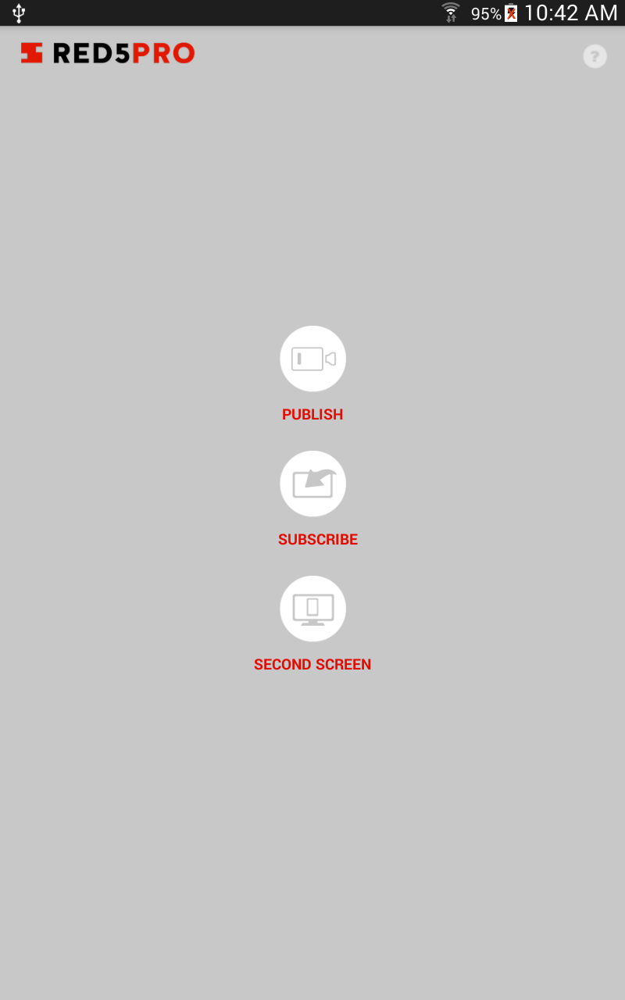

Starting Fresh
===
In this tutorial we will walk through downloading and starting the Red5 Pro server on your local machine!

If you have not done so already, start an account at [https://account.red5pro.com](https://account.red5pro.com). The Developer account allows for up to 10 concurrent connections, while the Enterprise license has no connection limit.

Installation
---
The Red5 Pro server requires Java 1.7+ or higher. [Install Java 1.7+ or higher](https://java.com/en/download/) if not already install on your machine.

1. Download the Red5 Pro server from [the downloads section](https://account.red5pro.com/download) of the Red5 Pro Accounts site.
2. Unzip into a location on your local system. For the purposes of this tutorial, we will unzip the Red5 Pro server to: _/Users/red5pro-user/red5pro_.
3. __Optional__: [Add your Red5 Pro license](http://link-to-tutorial), if you have signed up for the Enterprise account.
4. Start the Red5 Pro server:
  * On OSX & Linux: Open Terminal, `cd` into your Red5 Pro install directory and issue this command: `./red5.sh`
  * On Windows: Navigate to the Red5 Pro install directory in a File Browser and double-click on `red5.bat`
5. After the server has started, open a web browser and navigate to [http://localhost:5080](http://localhost:5080)
6. If the server has started successfully, you should see the default landing page for the Red5 Pro server install
  * The landing page can be found at _/webapps/root/index.jsp_ of your Red5 Pro installation. You can modify or remove it as desired. For now, we will use it to navigate around and demonstrate what the Red5 Pro server can do!

Live Streaming
---
For the following walk-throughs, you will need to install the Red5 Pro Demo Application on your favorite device(s).

On [iOS](http://location-to-ios-app)  
On [Android](http://location-to-ios-app)

### Publish
1. In a web browser, navigate to [http://localhost:5080/live/](http://localhost:5080/live/) and take note of the IP address that is printed at the top of the page
  * For the purposes of this tutorial, the IP address is listed as __10.0.0.15__ since we are running locally on our development machine
2. Launch the Red5 Pro application on your device and select __Publish__ from the menu
3. In the Settings dialog shown in the Red5 Pro application on your device, change the __Server__ field value to the IP address listed from Step 1
  * For the purposes of this tutorial, we changed the address value to __10.0.0.15__
4. From the Settings dialog, click __Done__
5. In the lower right of the Red5 Pro application on your device is a Record/Stop button, click to start recording
6. From the [http://localhost:5080/live/](http://localhost:5080/live/) page, locate the __Subscribe__ section and select __Access the list of active streams here__
7. From the stream listing at [http://localhost:5080/live/streams.jsp](http://localhost:5080/live/streams.jsp), select the __flash myStream__ link
8. __Watch youself!__

### Subscribe
1. In a web browser, navigate to [http://localhost:5080/live/](http://localhost:5080/live/) and take note of the IP address that is printed at the top of the page
  * For the purposes of this tutorial, the IP address is listed as __10.0.0.15__ since we are running locally on our development machine
2. From the [http://localhost:5080/live/](http://localhost:5080/live/) page, locate the __Broadcast__ section and select __Start broadcast here__
3. The web browser will redirect to [http://localhost:5080/live/broadcast.jsp](http://localhost:5080/live/broadcast.jsp) with a `host` query
  * For the purposes of this tutorial, the full address is __http://localhost:5080/live/broadcast.jsp?host=10.0.0.15__
4. You may be presented with various security alers - from the Flash Player and browser - to access camera and microphone from your computer. Accept them
5. In the __streamName__ field, enter in _myStream_
6. Click the __Broadcast Now__ button on the page
7. Launch the Red5 Pro application on your device and select __Subscribe__ from the menu
8. From the Settings Dialog of the Red5 Pro application on your device, change the __Server__ field value to the IP address listed from Step 1 (this is the same value as the `host` query value for the broadcast page)
9. From the Settings dialog, click __Done__
10. From the Red5 Pro application, click __Start Stream__
11. __Watch yourself!__

Second Screen
---
For the following walk-through, you will need to install the Red5 Pro Demo Application on your favorite device(s).

On [iOS](http://location-to-ios-app)  
On [Android](http://location-to-ios-app)

__Please ensure that your device and computer are connected to the same WiFi network in order to properly engage with the SecondScreen experience__

1. In a web browser, navigate to [http://localhost:5080/secondscreen/](http://localhost:5080/secondscreen/) and take not of the IP address that is printed at the top of the page
  * For the purposes of this tutorial, the IP address is listed as __10.0.0.15__ since we are running locally on our development machine
2. Select one of the __HTML5 Control Basic Example__ listed
3. The web browser will redirect to [http://localhost:5080/secondscreen/hosts/basic/](http://localhost:5080/secondscreen/hosts/basic/)
4. Launch the Red5 Pro application on your device and select __Second Screen__ from the menu
5. In the Settings dialog of the Red5 Pro application on your device, change the __Server__ feild value to the IP address listed from Step 1
6. From the Settings dialog, click __Done__
7. Wait for the connection to the Second Screen Registry server to be established
8. Once the device is connected, select __HTML5 Control Basic__ from the list
9. The control scheme defined for the __HTML5 Control Basic__ application will be sent down to the device and communication between the device (aka __Client__) and the webpage (aka __Host__) is open
  * To test the communication from __Host to Client__, click the __click me__ button on the webpage and view the messages receieved on the device
  * To test the communication from __client to Host__, click the __PUSH__ button on the device and view the messages received on the webpage

Of course, this is just the tip of the iceberg, but it demonstrates the communication channel and LAN registry connection capabilities of __Red5 Pro Second Screen__.

Troubleshooting
---
The following sections may aide in troubleshooting any issues may come across in trying the previous examples.

__If you have further questions, please contact us at [accounts@red5pro.com](accounts@red5pro.com)__

### Required open ports
The following default ports are required to be open in order to allow for Live Streaming and Second Screen:

* 5080 : default web access of Red5
* 1935 : default Red5 RTMP port
* 8554 : default RTSP port
* 8088 : default Second Screen Client registry
* 6262 : default Second Screen Host registry

